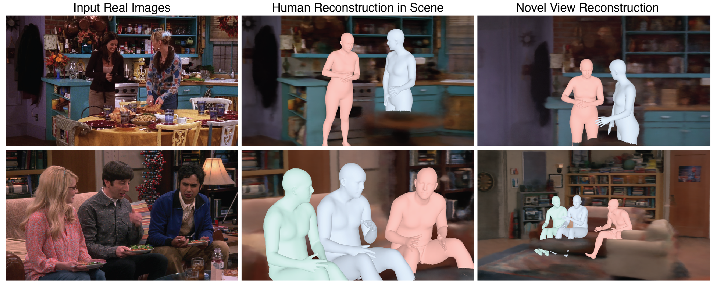

# Reconstructing 3D Humans and Environments in TV Shows

This is the repository for the paper "The One Where They Reconstructed 3D Humans and Environments in TV Shows" in [ECCV 2022](https://eccv2022.ecva.net/).  
[Georgios Pavlakos\*](https://geopavlakos.github.io/), [Ethan Weber\*](https://ethanweber.me/), [Matthew Tancik](https://www.matthewtancik.com/), [Angjoo Kanazawa](https://people.eecs.berkeley.edu/~kanazawa/)

#### You can find our project page at [https://ethanweber.me/sitcoms3D/](https://ethanweber.me/sitcoms3D/).



# Install environment

```bash
conda create --name sitcoms3D -y python=3.8
conda activate sitcoms3D
python -m pip install --upgrade pip
python setup.py develop
```

# Getting the data

To download the metadata related to our paper, please see [METADATA.md](METADATA.md).

# Demo with our data

We provide a demo of using our data in [notebooks/data_demo.ipynb](notebooks/data_demo.ipynb). To run this demo, you'll need to install the required packages in [requirements.txt](requirements.txt).

```bash
pip install -r requirements.txt
python download_smpl.py
# now open notebooks/data_demo.ipynb to play with the data
```

# Training NeRF

This is how you'd train with the `TBBT-big_living_room` environment. The runs will be saved to the `data/sparse_reconstruction_and_nerf_data/TBBT-big_living_room/runs` folder, which you can visualize with TensorBoard.

```bash
python sitcoms3D/nerf/run_train.py --environment_dir data/sparse_reconstruction_and_nerf_data/TBBT-big_living_room
```

> We recommend using [nerfstudio](https://docs.nerf.studio/en/latest/index.html) for future work with the sitcom3D data. A fast method with a sitcom3D dataloader (called the "friends" dataset) is under development [here](https://docs.nerf.studio/en/latest/nerfology/methods/semantic_nerfw.html). It can be used with a real-time viewer.

# Register new images to COLMAP sparse reconstructions

See [REGISTER_NEW_IMAGES.md](REGISTER_NEW_IMAGES.md) for details on how to register new images to our sparse reconstructions (i.e., to obtain new camera parameters for images in our sitcom rooms).

# Qualitative system evaluation

We used the codebase [https://github.com/ethanweber/anno](https://github.com/ethanweber/anno) for our qualitative system evaluation. The code requires data, setup, and webpage hosting. However, it is quite generalizable and can be used for many qualitative user study tasks. The basic idea behind the repo is to create HITs (human intelligence tasks) with questions each composed of (1) a question, (2) a list of media (images, videos, etc.) and (3) possible choices. Given the question, the user will respond with their answer choice. We employ consistency quality by showing the same questions multiple times with different ordering of media/choices and only keep responses where annotators performed sufficiently well.

# Citing

If you find this code or data useful for your research, please consider citing the following paper:

    @Inproceedings{pavlakos2022sitcoms3d,
      Title          = {The One Where They Reconstructed 3D Humans and Environments in TV Shows},
      Author         = {Pavlakos, Georgios and Weber, Ethan and Tancik, Matthew and Kanazawa, Angjoo},
      Booktitle      = {ECCV},
      Year           = {2022}
    }
